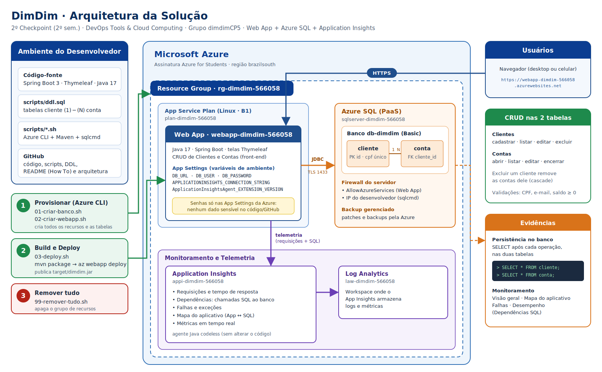

# DimDim · Web App + Azure SQL + Application Insights

**2º Checkpoint (2º semestre) · DevOps Tools & Cloud Computing · FIAP**
Grupo **dimdimCP5**

| Integrante | RM |
|---|---|
| Pedro Gabriel Claes (representante) | RM566058 |
| Matheus Arazin de Oliveira | RM556649 |
| Artur Pioli Silva | RM565597 |
| Kevin Martins Campos | RM563454 |

- **Aplicação publicada:** https://webapp-dimdim-566058.azurewebsites.net
- **Vídeo com as evidências:** 

---

## 1. Descrição da solução

A DimDim precisava publicar uma aplicação web na nuvem com persistência em um banco de dados gerenciado (PaaS) e monitoramento da aplicação e do banco.

A solução é uma aplicação **Java 17 com Spring Boot e telas em Thymeleaf** (front-end, não é uma API) para a gestão de **clientes** e das **contas** de cada cliente. As duas tabelas têm relacionamento **1:N** (um cliente possui várias contas) e a aplicação oferece **CRUD completo nas duas**:

- **Clientes:** cadastrar, listar, editar e excluir (excluir um cliente remove também as contas dele).
- **Contas:** abrir, listar, editar e encerrar, sempre vinculadas a um cliente titular.

Na Azure, a aplicação roda em um **Web App (App Service Linux)**, persiste os dados no **Azure SQL Database** e é monitorada pelo **Application Insights**, que coleta requisições, tempos de resposta, falhas e as **chamadas SQL ao banco**.

Toda a infraestrutura é criada **via Azure CLI**, pelos scripts da pasta [`scripts/`](scripts). O deploy é automatizado com **Azure CLI + `az webapp deploy`**.

> **Sobre os arquivos JSON:** o enunciado pede o JSON das operações GET/POST/PUT/DELETE apenas quando a entrega é uma API. Esta solução é uma aplicação web com front-end (Thymeleaf), então as operações são feitas pelas telas e evidenciadas no banco por `SELECT`.

## 2. Arquitetura



| Recurso | Nome | Função |
|---|---|---|
| Grupo de recursos | `rg-dimdim-566058` | Agrupa todos os recursos (região `brazilsouth`) |
| Servidor Azure SQL | `sqlserver-dimdim-566058` | Servidor lógico do banco (PaaS) |
| Banco de dados | `db-dimdim` | Banco **Basic** com as tabelas `cliente` e `conta` |
| Plano do App Service | `plan-dimdim-566058` | Plano **Linux B1** |
| Web App | `webapp-dimdim-566058` | Hospeda a aplicação Java 17 |
| Application Insights | `appi-dimdim-566058` | Monitoramento da aplicação e das chamadas ao banco |
| Log Analytics | `law-dimdim-566058` | Workspace onde o Application Insights guarda os dados |

## 3. Tecnologias

- Java 17, Spring Boot 3.3, Spring Data JPA, Bean Validation, Thymeleaf
- Driver `mssql-jdbc` (Azure SQL / SQL Server)
- Azure CLI, App Service (Web App Linux), Azure SQL Database, Application Insights, Log Analytics
- Maven, `sqlcmd` e Bash

## 4. Estrutura do repositório

```
.
├── pom.xml
├── README.md
├── docs/
│   └── arquitetura.png              # desenho da arquitetura
├── scripts/
│   ├── 00-variaveis.sh              # nomes dos recursos (carregado pelos outros scripts)
│   ├── 01-criar-banco.sh            # grupo de recursos, Azure SQL, firewall, banco e tabelas
│   ├── 02-criar-webapp.sh           # Log Analytics, App Insights, plano, Web App e variáveis
│   ├── 03-deploy.sh                 # build (Maven) e deploy (az webapp deploy)
│   ├── 99-remover-tudo.sh           # remove o grupo de recursos
│   └── ddl.sql                      # DDL das tabelas
└── src/main/
    ├── java/br/com/fiap/dimdim/
    │   ├── controller/              # ClienteController, ContaController, HomeController
    │   ├── model/                   # Cliente, Conta, TipoConta
    │   └── repository/              # ClienteRepository, ContaRepository
    └── resources/
        ├── application.properties   # lê DB_URL, DB_USER e DB_PASSWORD do ambiente
        ├── static/css/dimdim.css
        └── templates/               # telas Thymeleaf
```

## 5. Modelo de dados

O DDL completo está em [`scripts/ddl.sql`](scripts/ddl.sql).

- **cliente:** `id` (PK, identity), `nome`, `cpf` (único), `email`, `data_cadastro`
- **conta:** `id` (PK, identity), `numero` (único), `agencia`, `tipo` (`CORRENTE` ou `POUPANCA`), `saldo` (≥ 0), `cliente_id` (FK → `cliente.id`)

## 6. How To: implantação completa na Azure

### 6.1 Pré-requisitos

Terminal Linux (Bash) com:

- **Azure CLI**: `curl -sL https://aka.ms/InstallAzureCLIDeb | sudo bash`
- **JDK 17 ou superior** e **Maven**: `sudo apt install -y openjdk-21-jdk-headless maven`
- **sqlcmd** (go-sqlcmd):
  ```bash
  curl -L -o /tmp/sqlcmd.tar.bz2 https://github.com/microsoft/go-sqlcmd/releases/latest/download/sqlcmd-linux-amd64.tar.bz2
  sudo tar -xjf /tmp/sqlcmd.tar.bz2 -C /usr/local/bin sqlcmd
  ```

### 6.2 Clonar o projeto e entrar na Azure

```bash
git clone https://github.com/PedroClaes/imdim-webapp.git  
cd <PASTA_DO_REPOSITORIO>
chmod +x scripts/*.sh

az login
az account show --output table
```

> Os nomes dos recursos ficam em `scripts/00-variaveis.sh`. Para usar outro RM ou outra região permitida pela política da assinatura (ex.: `eastus`), altere `RM` e `LOCATION` nesse arquivo.

### 6.3 Criar o banco: `01-criar-banco.sh`

```bash
./scripts/01-criar-banco.sh
```

O script pede a **senha do administrador do SQL** (mínimo de 8 caracteres, com maiúscula, minúscula, número e símbolo). A senha **não é gravada em nenhum arquivo**.

O que ele faz, nesta ordem:

1. Registra o provider `Microsoft.Sql`
2. Cria o grupo de recursos `rg-dimdim-566058`
3. Cria o servidor `sqlserver-dimdim-566058`
4. Cria as regras de firewall `AllowAzureServices` (acesso do Web App) e a do IP da máquina que executa o script
5. Cria o banco `db-dimdim` (Basic)
6. Executa o `scripts/ddl.sql` com o `sqlcmd`, criando as tabelas

### 6.4 Criar o Web App e o monitoramento: `02-criar-webapp.sh`

```bash
./scripts/02-criar-webapp.sh
```

O script pede a **mesma senha do banco** e faz o seguinte:

1. Registra os providers `Microsoft.Web`, `Microsoft.Insights` e `Microsoft.OperationalInsights`
2. Cria o workspace do Log Analytics e o Application Insights
3. Cria o plano do App Service (Linux B1) e o Web App (Java 17)
4. Configura as **App Settings** do Web App:
   - `DB_URL`, `DB_USER`, `DB_PASSWORD`: conexão com o Azure SQL
   - `APPLICATIONINSIGHTS_CONNECTION_STRING`, `ApplicationInsightsAgent_EXTENSION_VERSION=~3`: ativam o agente Java do Application Insights
   - `SERVER_PORT=80`: porta usada pelo App Service
5. Conecta o Web App ao Application Insights, ativa os logs e reinicia o Web App

### 6.5 Build e deploy: `03-deploy.sh`

```bash
./scripts/03-deploy.sh
```

O script compila o projeto com `mvn clean package` e publica o `target/dimdim.jar` com:

```bash
az webapp deploy --resource-group rg-dimdim-566058 --name webapp-dimdim-566058 --src-path target/dimdim.jar --type jar
```

Ao final, acesse **https://webapp-dimdim-566058.azurewebsites.net**. A primeira inicialização leva de 1 a 3 minutos.

Para acompanhar os logs da aplicação:

```bash
az webapp log tail --name webapp-dimdim-566058 --resource-group rg-dimdim-566058
```

### 6.6 Testes: CRUD com evidência no banco

Abra uma sessão do `sqlcmd` e **mantenha-a aberta** durante os testes:

```bash
sqlcmd -S sqlserver-dimdim-566058.database.windows.net -d db-dimdim -U dimdimadmin
```

Depois de cada operação feita no site, consulte as tabelas na mesma sessão:

```sql
SELECT * FROM cliente;
SELECT * FROM conta;
GO
```

Roteiro de testes:

| # | Operação no site | O que conferir no `SELECT` |
|---|---|---|
| 1 | Cadastrar 2 clientes | 2 linhas em `cliente` |
| 2 | Editar um cliente | dados alterados em `cliente` |
| 3 | Abrir 2 contas para o mesmo cliente | 2 linhas em `conta` com o mesmo `cliente_id` |
| 4 | Editar uma conta (ex.: saldo) | `saldo` alterado em `conta` |
| 5 | Encerrar uma conta | linha removida de `conta` |
| 6 | Excluir o cliente que tem conta | linha removida de `cliente` e as contas dele removidas de `conta` |

### 6.7 Monitoramento: Application Insights

No portal da Azure, abra **appi-dimdim-566058** e, em **Investigar**:

- **Visão geral:** solicitações, tempo de resposta e falhas
- **Mapa do aplicativo:** o Web App ligado ao banco Azure SQL
- **Métricas em tempo real:** requisições acontecendo durante os testes
- **Desempenho → Dependências:** as chamadas SQL ao `db-dimdim`, com quantidade e duração
- **Falhas:** requisições com erro e exceções

### 6.8 Remover os recursos

```bash
./scripts/99-remover-tudo.sh
```

O script pede a confirmação do nome do grupo e executa `az group delete`, removendo todos os recursos.

## 7. Segurança

- **Nenhum usuário, senha ou token está no código-fonte.** O `application.properties` só lê `${DB_URL}`, `${DB_USER}` e `${DB_PASSWORD}`.
- Na Azure, esses valores ficam nas **App Settings** do Web App. Os scripts pedem a senha no terminal, sem gravá-la em arquivo.
- O firewall do Azure SQL libera apenas os serviços da Azure (Web App) e o IP de quem executa os scripts.

## 8. Executar localmente (opcional, apenas para desenvolvimento)

Com o IP liberado no firewall do Azure SQL, defina as variáveis e rode a aplicação:

```bash
export DB_URL="jdbc:sqlserver://sqlserver-dimdim-566058.database.windows.net:1433;database=db-dimdim;encrypt=true;trustServerCertificate=false;hostNameInCertificate=*.database.windows.net;loginTimeout=30;"
export DB_USER="dimdimadmin"
export DB_PASSWORD="<SENHA>"
mvn spring-boot:run
```

A aplicação sobe em http://localhost:8080. A entrega oficial é a versão publicada na Azure.
